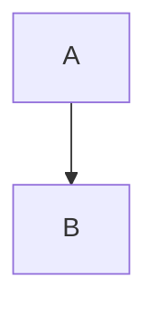

# Scaling & Options

- Every Mermaid diagram must use scale 0.8 by default.
- Apply options using the syntax: `{theme: 'neutral', scale: 0.8}` after `mermaid` in the code block.
- Example:

````

````
- Use single quotes for strings and comma between keys in the options object.
