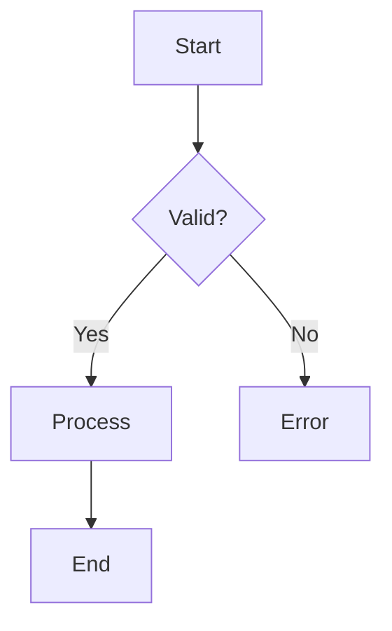

# Skill: draw-mermaid

## Purpose
Draw valid, clear, and self-explanatory Mermaid diagrams for documentation, presentations, and technical communication.

## Rules Location
All rules for this skill are defined in the `.roo/rules-draw-mermaid/` folder. Each file contains a single, focused rule. Do not duplicate rules here.

## How to Use
- Follow all rules in `.roo/rules-draw-mermaid/` strictly.
- Always select the appropriate diagram type for the intent.
- Output only a fenced Mermaid code block unless otherwise requested.
- Never explain Mermaid syntax unless explicitly asked.

## Output Format
- Diagrams must be wrapped in triple backticks with `mermaid` as the language.
- No extra commentary or explanation unless requested.

## Example
````

````
