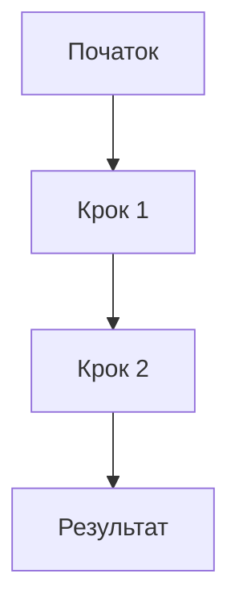

# New Slide Instructions

When the user requests batch slide creation for a Slidev presentation:

1. Collect inputs:
   - target section or insertion point,
   - thesis-based outline,
   - number of slides to generate,
   - requirement for a single Mermaid diagram (optional).
2. Draft slides based on the outline:
   - split content logically across slides,
   - ensure one main idea per slide.
3. Apply language conventions:
   - all slide titles, bullets, and notes in **Ukrainian**,
   - English allowed only for code, CLI commands, file paths, configuration values, and untranslatable technical terms.
4. Add progressive disclosure:
   - apply `v-clicks` where appropriate to avoid information overload.
5. Add speaker notes:
   - move explanations, links, and references into `:::notes`,
   - keep slide bodies concise and scannable.
6. If requested, add **one Mermaid diagram**:
   - ensure valid Mermaid syntax,
   - keep diagram readable and directly related to the section topic.
7. Write output as a module:
   - create files under `pages/.../*.md`,
   - import them into `slides.md`.
8. Run build verification using the build-verify skill.
9. Finish only if the build succeeds.

---

## Code Template

```md
---
## Назва слайду
- Ключова теза 1
- Ключова теза 2
- Ключова теза 3

:::notes
Пояснення для доповідача українською мовою.
Посилання та джерела:
- https://example.com
:::
```

### Mermaid Example (optional)



---

## Output Structure

- One or more Markdown files under:
  - `pages/<section-name>/*.md`
- Corresponding imports added to:
  - `slides.md`
- No unrelated files modified.

---

## Safety Rules

- Do not create “walls of text” on slides.
- Do not exceed 3–5 bullet points per slide.
- Do not place external links directly on slides.
- Do not mix Ukrainian and English in slide text.
- Do not modify existing slides unless explicitly required.

---

## Definition of Done (DoD)

- Slides are generated in Ukrainian and follow Slidev conventions.
- Notes contain explanations and links.
- Optional Mermaid diagram renders correctly.
- Files are correctly imported into `slides.md`.
- Build verification passes successfully.

---

## Common Issues

- Too much content on one slide: split into multiple slides.
- Missing notes: add speaker notes with explanations and links.
- Invalid Mermaid syntax: simplify and validate diagram.
- Build failure after insertion: fix errors and re-run build until green.
